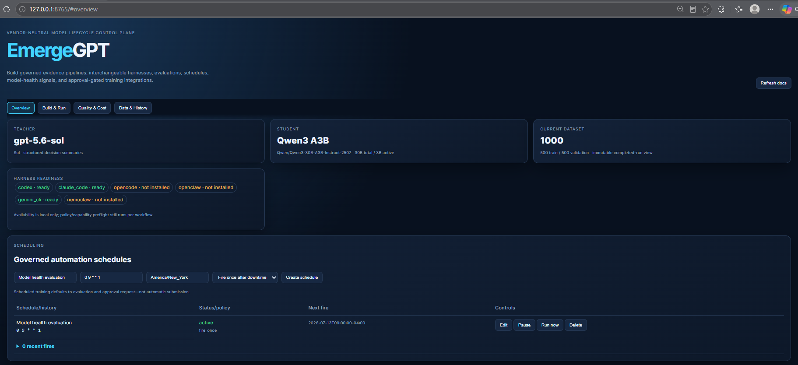

# EmergeGPT

## Demo video

<video src="docs/media/emergegpt-demo.mp4" controls width="100%">
  <a href="docs/media/emergegpt-demo.mp4">Watch the EmergeGPT demo video</a>.
</video>

[Watch or download the EmergeGPT demo video](docs/media/emergegpt-demo.mp4)



EmergeGPT is a vendor-neutral, auditable model-lifecycle control plane. It turns synthetic or separately authorized evidence into reviewed datasets, runs capability-gated LoRA or full-parameter training, compares model quality and cost, schedules evaluations, recommends when fine-tuning may help, and exposes interchangeable harness and MCP integrations.

The UI includes license-evidenced Nebius teacher selection, matched base-versus-tuned cost savings, and a persisted Pipeline Runs console. A selected model harness receives the immutable run request and controls the compatible command sequence within EmergeGPT's approval and policy ceiling; the monitor survives page refreshes.

Model decision: the original `Qwen/Qwen3.5-9B` is unavailable. The active student is `Qwen/Qwen3-30B-A3B-Instruct-2507`: it is visible to this API key and officially supports LoRA and full-parameter training. This project uses LoRA.

It now also contains a gated automation pipeline for distilling those traces into the selected Qwen3 MoE model and fine-tuning through Nebius Token Factory. Start with [the automation guide](docs/automation.md) and [tool inventory](docs/tool-inventory.md).

## Where everything lives

| Item | Location | Purpose |
| --- | --- | --- |
| Codex project configuration | `.codex/config.toml` | Connects only to the public documentation MCP; live tenant configuration is local/generated |
| Sol's standing instructions | `AGENTS.md` | Tells Codex how to work in this repository |
| Architecture and vocabulary | `docs/architecture.md` | Explains the design in beginner-friendly language |
| Trace contract | `schemas/reasoning-trace.schema.json` | Defines the shared auditable trace format |
| Domain designs | `designs/<domain>/design.yaml` | Captures each catalog or registry design |
| Worked traces | `examples/` | Holds example trace instances as they are created |
| Fine-tuning configuration | `config/pipeline.json` | Pins teacher, student, CRAFT, Nebius, and eval settings |
| Automation CLI | `scripts/pipeline.py` | Generates, validates, submits, monitors, and evaluates |
| Local credentials | `.env` | Git-ignored, mode `0600`; never commit this file |
| LLM evaluation suite | `evals/` | Project-owned task, safety, grounding, tool-use, robustness, latency, and cost evaluations |
| Digital Analytics evidence | generated synthetic fixtures | Public demo contains no event tenant snapshot or source rows |
| Current teacher dataset | `data/generated/digital-analytics-1000-teacher.jsonl` | 1,000 deterministic auditable examples |
| Current split | `artifacts/digital-analytics-1000-dataset/` | 500 training, 500 validation, manifest, and review |
| Dashboard and voice UI | `ui/` | Session charts, dataset view, grounded Q&A, STT, and TTS |
| MCP policy gateways | `emergegpt_mcp/` | CRAFT docs/authorization readiness and Nebius docs/API tools |
| MCP Builder guide | `docs/mcp-builder.md` | Step-through UI setup, harness snippets, and safety boundaries |
| Security and licensing | `docs/security.md`, `docs/licensing.md` | Productization gates, NDA/EULA boundary, and license recommendation |
| Enterprise business case | `docs/enterprise-business-case.md` | Use cases, buyer value, proposed pricing, ROI, and Unsloth comparison |
| Enterprise presentation | `docs/EmergeGPT_Deck_Updated.pptx` | Six-slide simplified executive narrative |

The project registers public documentation only. Live provider or tenant configuration is generated locally through the MCP Builder and is never committed automatically.

## Start here

1. Change into this directory:

   ```bash
   cd /llm_models_python_code_src/emergence-craft-reasoning
   ```

2. Create local environment configuration:

   ```bash
   cp .env.example .env
   chmod 600 .env
   ```

3. Run tests and the local UI:

   ```bash
   python3 -m unittest discover -s tests -q
   python3 ui/server.py
   ```

4. Open `http://127.0.0.1:8765` and use **Integrations → MCP Builder** to preview and validate CRAFT or Nebius policy gateways. A live CRAFT connector requires separate current written authorization and deployer-owned configuration.

## Connection details

- Live tenant endpoint/project/authentication: deployer-provided only after separate written authorization
- Scope handling: environment-backed and redacted by the EmergeGPT CRAFT policy gateway
- Documentation server: `emergence-craft` at `https://docs.emergence.ai/mcp`
- Nebius project: `replace-with-your-project-id`
- Nebius API: `https://api.tokenfactory.nebius.com/v1/`
- Active category: Digital Analytics
- Public demo catalogs: `synthetic-mobile.MOBILE_ANALYTICS` and `synthetic-web.WEB_ANALYTICS`

Public CRAFT documentation access does not imply tenant/API authorization. EmergeGPT does not distribute event credentials, tenant endpoints, project IDs, platform data, or confidential implementation details.

## Fine-tuning workflow

Create `.env` from the safe template and insert credentials locally:

```bash
cp .env.example .env
chmod 600 .env
```

Then run:

```bash
python3 scripts/pipeline.py preflight-nebius
python3 scripts/pipeline.py student-smoke
python3 scripts/build_digital_analytics_seeds.py
python3 scripts/pipeline.py prepare --input data/generated/digital-analytics-1000-teacher.jsonl --output-dir artifacts/digital-analytics-1000-dataset
python3 scripts/pipeline.py submit --training-mode lora --dataset-dir artifacts/digital-analytics-1000-dataset
python3 scripts/pipeline.py monitor <job-id> --max-seconds 600
python3 scripts/pipeline.py eval --model Qwen/Qwen3-30B-A3B-Instruct-2507
```

Nebius model eligibility and the current dataset review pass. Each future dataset must still receive its own review record before upload.

Run limits are explicit per session: the first demo used 15 minutes, the 8-example Digital Analytics run allowed 30 minutes, the 200-example run used 10 minutes, and the current 1,000-example run used a strict one-hour limit. `monitor --max-seconds` cancels any job still active at its configured boundary.

The public dataset uses fully synthetic mobile/web evidence identifiers. Authorized private deployments may build separate ignored snapshots through a connector they are legally permitted to use. Examples remain `needs_review` when dates, definitions, authorization, freshness, or quality evidence are missing.

The current reproducible dataset contains 1,000 deterministic, catalog-grounded trace variations across ten policy/workflow templates, twenty scenarios, and five analysis windows. It is split exactly 500/500 between training and validation in `artifacts/digital-analytics-1000-dataset/`. This large validation share checks template consistency; because both halves share templates, it must not be presented as an independent generalization benchmark.

## Team dataset review

The current teacher batch and grounding evidence are committed so collaborators can inspect them in GitHub:

- synthetic mobile/web fixture identifiers generated by `scripts/build_digital_analytics_seeds.py`
- `data/generated/digital-analytics-1000-teacher.jsonl` — 1,000 generated trace examples
- `artifacts/digital-analytics-1000-dataset/train.jsonl` — 500-example training split
- `artifacts/digital-analytics-1000-dataset/validation.jsonl` — 500-example validation split
- `artifacts/digital-analytics-1000-dataset/manifest.json` — source hash, model, seed, and counts
- `artifacts/digital-analytics-1000-dataset/review.json` — approval and known limitations

Reviewers should verify correctness, evidence references, policy decisions, tool outcomes, privacy, and absence of invented APIs before changing an example from `needs_review` to `passed`.

The evaluation suite is documented in `evals/README.md`. The dashboard distinguishes methods actually run from planned definitions. A fair base-versus-tuned comparison remains pending deployment and identical held-out prompts/settings against both variants.

## Local management UI

Run the local-only dashboard:

```bash
python3 ui/server.py
```

Open `http://127.0.0.1:8765`. The EmergeGPT UI shows the current 1,000-example dataset, live Nebius jobs, LoRA settings, immutable training-session history, per-session loss charts, cross-session final-loss comparison, and LLM evaluations. Completed dataset records are read-only in the UI, preventing approval-button experiments from changing historical training inputs. It binds only to localhost and never returns API keys or OAuth tokens.

For dashboard-grounded voice Q&A, start a second subprocess:

```bash
python3 ui/voice_server.py
```

The dashboard uses the browser Web Speech API for speech-to-text and text-to-speech when supported; typed questions remain available everywhere. The subprocess retrieves fresh `/api/dashboard` data and sends it to the configured Nebius inference model with the question. Live inference was verified with `Qwen/Qwen3-30B-A3B-Instruct-2507` at `$0.10` per million input tokens and `$0.30` per million output tokens. Missing prices disable inference, the ledger is stored at `runs/voice-budget.json`, and the voice ceiling is `$50`; the remaining `$25` of the user's `$75` project budget is reserved for fine-tuning and evaluation. The voice service enforces its allocation locally, while the 30-minute training watchdog limits training duration because the available Nebius API does not expose an account-wide dollar stop.

Voice capabilities initialize during dashboard load. Separate indicators show whether Q&A inference, microphone/STT, and speaker/TTS are ready. Pressing **Ask by voice** starts the pre-initialized recognizer, and every successful answer is read aloud automatically; **Read answer** replays it.

Architecture, catalog, and platform-feature questions use the dynamic approved documentation index. New documentation becomes searchable after refresh; answers cite repository paths and label features as used, available, or pending. Credentials, private planning files, raw datasets, ignored paths, and arbitrary files are excluded.

The first bounded LoRA pipeline-validation job, `ftjob-a16a0aa96695477593c126598b12f88b`, completed successfully in 3 steps and 1,437 trained tokens. It is not promoted until checkpoint evaluations pass; see `evals/results/`.

Four sessions are recorded: the initial 3-example validation run, an 8-example Digital Analytics run, a 200-example run, and the current 1,000-example run. The latest job `ftjob-8ae7abeefe1242b08eaf306b230df120` trained on 500 examples, validated on 500, processed 408,285 tokens, and succeeded in 515 seconds under its 3,600-second limit. Its final recorded checkpoint had 6.1220 training loss and 3.7764 validation loss; these are training diagnostics, not proof of quality improvement.

## Useful commands

```bash
codex mcp get emergence-craft
codex mcp list
codex mcp remove emergence-craft
```

## License

Licensed under the [GNU Affero General Public License v3.0 only](LICENSE). Network users of a modified version must be offered its corresponding source code under the same license.

## Safety rule

Store concise decision summaries and evidence references, never private chain-of-thought, passwords, access tokens, raw secrets, or sensitive source records.
